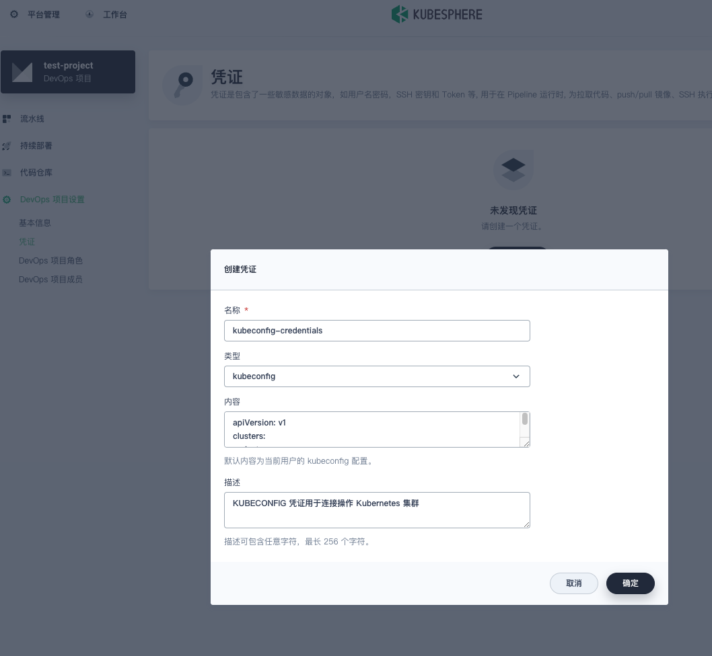
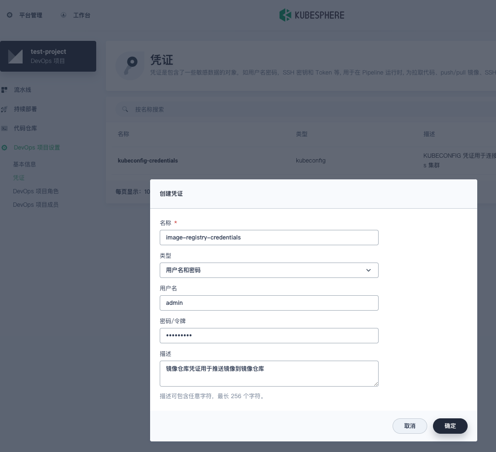
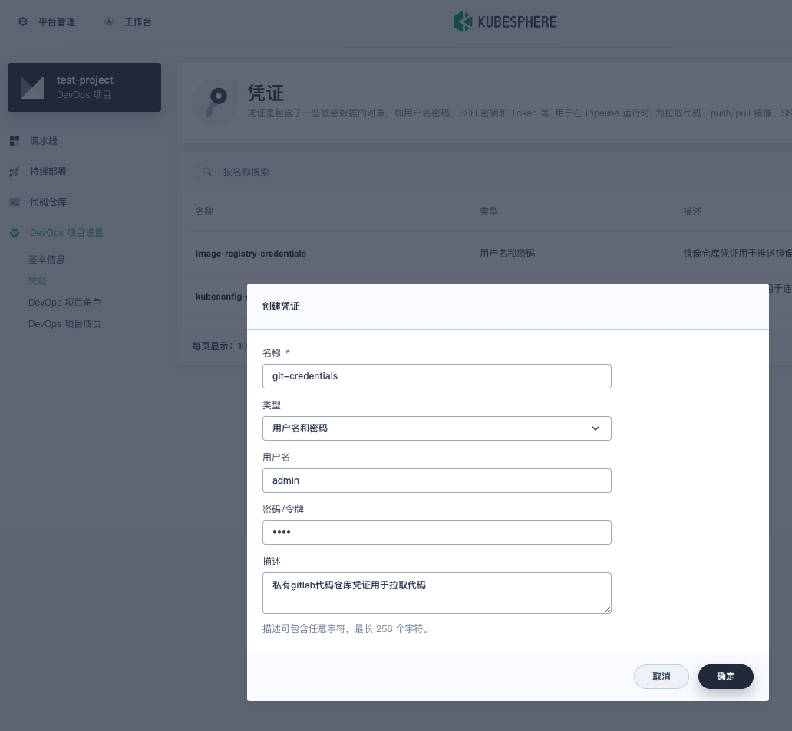
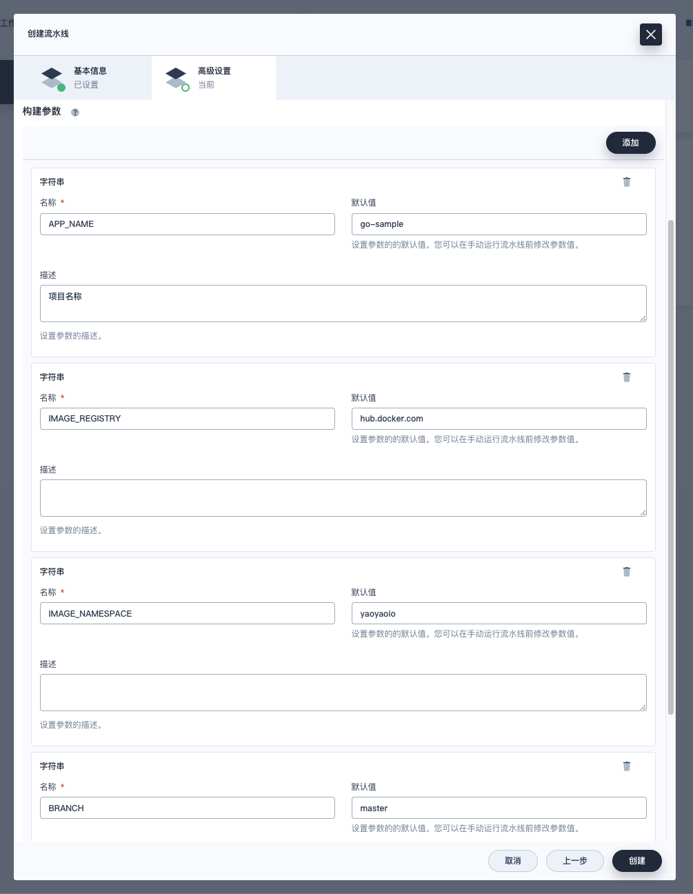
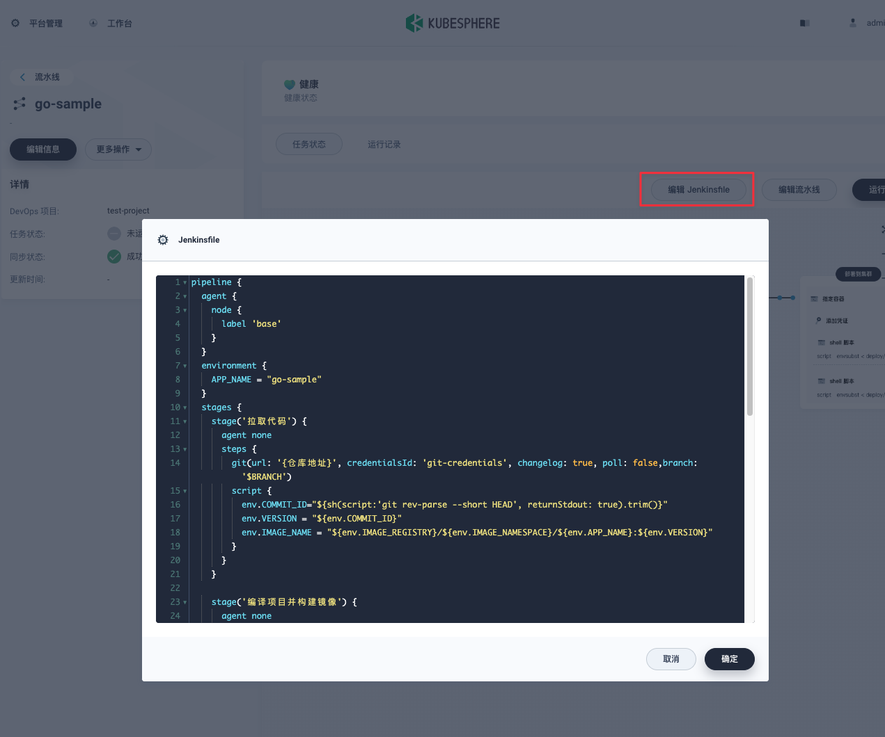

# project-devops-template

多种语言的 CICD 模版 流水线项目

## 介绍

本项目主要提供不同语言的容器化构建 基于 Kubesphere 流水线示例模版，以及一些常用构建工具的使用方法。

## 变量

* $APP_NAME 项目名称
* $VERSION 版本号
* $IMAGE_REGISTRY 容器镜像仓库地址
* $IMAGE_NAMESPACE 容器仓库命名空间/组织空间 不同云厂商有不同的命名方式
* $IMAGE_USER 容器仓库用户名
* $IMAGE_PASSWD 容器仓库密码
* $IMAGE_NAME 镜像名称 生成规则` "${IMAGE_REGISTRY}/${IMAGE_NAMESPACE}/${APP_NAME}:${VERSION}"`
* $BRANCH 分支名称
* $GIT_URL 代码仓库地址
* $COMMIT_ID 代码提交ID 使用 `git rev-parse --short HEAD` 获取

## 版本号

默认我使用 `$COMMIT_ID` 作为版本号，如果你需要使用其他版本号，可以在流水线中修改 `$VERSION`，然后在构建步骤中使用`$VERSION`
.

**例如**：

* $COMMIT_ID 代码提交ID 使用 `git rev-parse --short HEAD` 获取
* $GIT_TAG 代码标签
* $GIT_BRANCH 代码分支

修改方式 修改每个项目的 `Jenkinsfile` 文件，修改 `$VERSION` 变量的值:

```groovy
steps {
    script {
        env.COMMIT_ID = "${sh(script: 'git rev-parse --short HEAD', returnStdout: true).trim()}"
        env.VERSION = "${env.COMMIT_ID}"
        env.IMAGE_NAME = "${env.IMAGE_REGISTRY}/${env.IMAGE_NAMESPACE}/${env.APP_NAME}:${env.VERSION}"
    }
}
```

## 凭证 (Kubernetes Secret)

### KUBECONFIG 凭证

KUBECONFIG 凭证用于连接操作 Kubernetes 集群，需要在流水线中配置。

可以在 Kubepshere 工作台 -> 企业空间 -> {你的空间} -> Devops 项目--> {项目名称} -> 凭证 -> 创建凭证 ->
选择类型为 `KUBECONFIG` 名称为 `kubeconfig-credentials`



### 镜像仓库凭证

镜像仓库凭证用于推送镜像到镜像仓库，需要在流水线中配置。

可以在 Kubepshere 工作台 -> 企业空间 -> {你的空间} -> Devops 项目--> {项目名称} -> 凭证 -> 创建凭证 ->
选择类型为 `用户名和密码（账户凭证）` 名称为 `image-registry-credentials`



### 代码仓库凭证

代码仓库凭证用于拉取代码，需要在流水线中配置。

可以在 Kubepshere 工作台 -> 企业空间 -> {你的空间} -> Devops 项目--> {项目名称} -> 凭证 -> 创建凭证 ->
选择类型为 `用户名和密码（账户凭证）` 名称为 `git-credentials`



以上配置好之后 可以在流水线中使用对应凭证。

## 流水线 (Jenkinsfile)

每个项目下都有一个 `Jenkinsfile` 文件，这个文件是流水线的配置文件，可以在流水线中配置流水线的各个步骤。

在 Kubesphere 中 可以直接使用 Jenkinsfile 来创建流水线。也可以在 kubeSphere 中可视化创建流水线 最后也会生成 Jenkinsfile
文件。

以 go-sample 项目为例，

### 第一步 创建流水线


### 第二步 填写构建参数


### 第三步 选择流水线配置文件 这个地方我们选择 编写 `Jenkinsfile` 文件 将{project}下的 `Jenkinsfile` 文件复制到这里
